# Hackathon Board 👨‍💻

A site where people can post hackathons and register hackathons

## Users
1. The hackers
2. Hosters
3. Admins
4. Guests

## User Roles
### The Hackers
- Has all guest roles
- Can create, view and join teams
- Can register for hackathons
- Can make subscriptions
- Can manage their applications
- Can add and manage personal details

### The Hosters
- Has all guest roles
- Can add hackathons
- Can mark a team as a winner
- Can approve team or individual requests

### Admins
- Approves hackthons

### Guests
- Can view upcoming and live hackathons
- Can view leaderboards

### Other functionalities
- Share hackathons on social media

## Stories

### Stage 1: Add a hackathon

```mermaid
sequenceDiagram
    participant Hoster 🌐
    participant Admin 👑
    participant Hacker 👨‍💻
      Hoster 🌐->>Admin 👑: Here is a new hackathon?
      alt approve hackathon
          Admin 👑->>Hoster 🌐: Yay your hackthon is valid!
          Admin 👑-->>Hacker 👨‍💻: We got a hackathon!
      else decline hackathon
        Admin 👑->>Hoster 🌐: Your hackathon is not valid
      end
  
```

1. Hoster registers or signs up
2. They add a hackerthon and submits it
3. The admin reviews and approves
4. A message get broadcasted to all subscribed members
5. The hackthon is displayed on the board
**Stage 4 and 5 can be done in parallel to speed things up**

### Stage 2: Registering for a hackthon

```mermaid
sequenceDiagram
    participant Hoster 🌐
    participant System 🖥️
    participant Hacker 👨‍💻
      Hacker 👨‍💻->>+System 🖥️:Here are my creds
      System 🖥️->>-Hacker 👨‍💻: Cool, your are in
      Hacker 👨‍💻->>Hoster 🌐: 🥺 Hey, I want to participate
  
```

1. Hacker registers or signs up
2. The click a hackthon and add their details
3. And clicks submit

**Note that a hackar can register as an individual or register as a team. They must be a team lead to do and a check is made to see if they not applied yet**

### Stage 3: Approving requests

```mermaid
sequenceDiagram
    participant Hoster 🌐
    participant System 🖥️
    participant Hacker 👨‍💻
    

      activate Hoster 🌐
      alt approve hacker
          Hoster 🌐->>Hacker 👨‍💻: ✅ Cool
      else decline hacker
          Hoster 🌐->>Hacker 👨‍💻: ❌ Nop you cant
          
      end
      deactivate Hoster 🌐
      System 🖥️-->>Hacker 👨‍💻: ✉️ You got approved/declined
      
  
```

1. Hoster can see all applicants
2. They can approve and delete applications
3. A message is sent

**Stage 3 and 2 are done in parralel**

## Relationships
User can be Hacker, Hoster or Admin
Hacker has Applications
Hoster has Hackathons
Hackerthons have Applications
Hackarthons have tags

